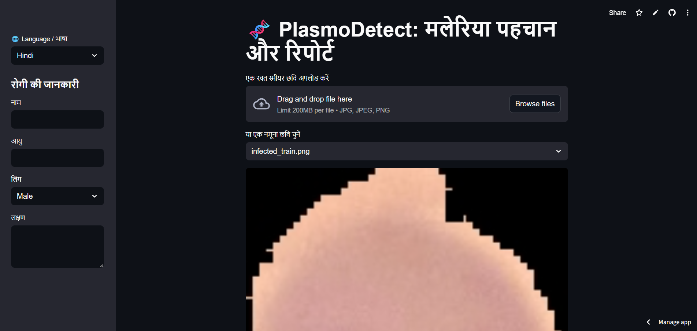
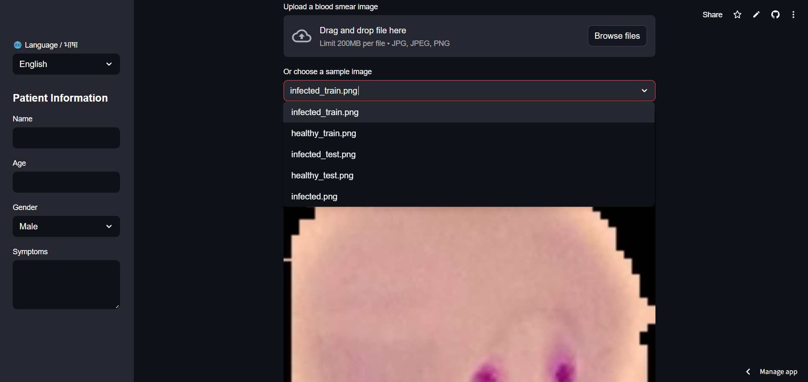
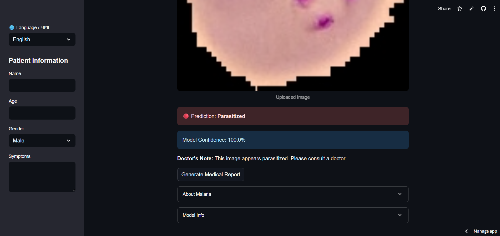
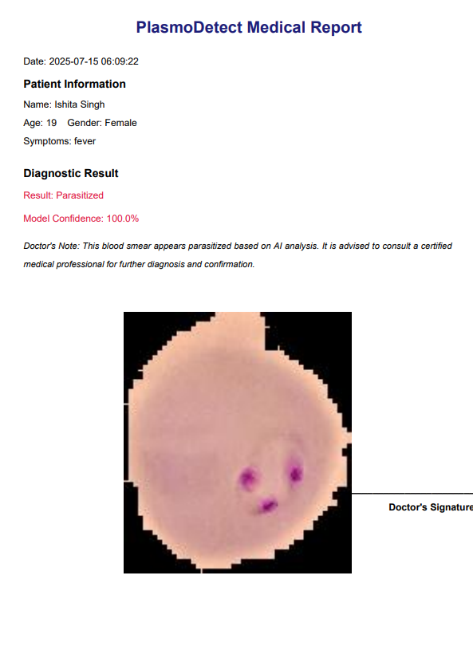
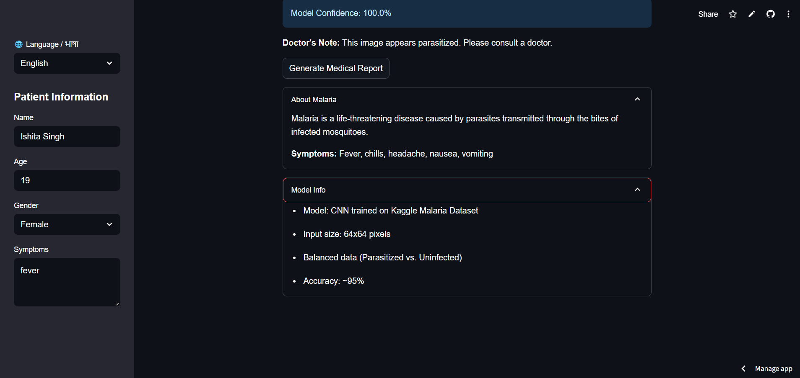
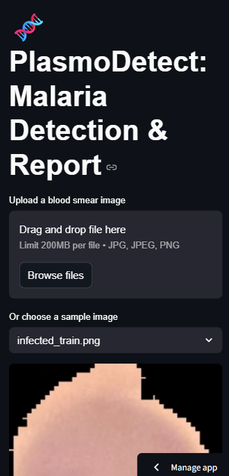

# 🧫 PlasmoDetect – Deep Learning–Based Malaria Detection App

**PlasmoDetect** is a medical image classification tool that uses a **Convolutional Neural Network (CNN)** to detect **malaria parasites** in blood smear images. Built with care and accuracy, it offers a modern, multilingual, mobile-friendly UI that helps users — patients or doctors — upload samples and get detailed medical feedback instantly.

---

## 🔗 Live Demo

🌐 [Try PlasmoDetect on Vercel](https://plasmodetect-axxlrvttwn8zuleet3xyij.streamlit.app/)  

---

## ✨ Features

- 🔍 **Malaria Detection** from blood smear images using a trained CNN model (~94% accuracy)
- 📷 **Image Input Options**:
  - Upload your **own cell image**, or
  - Choose from our provided **sample images**
- 🌐 **Multilingual Support** – Switch between **English and Hindi**
- 🧠 **Detailed Predictions**:
  - Final result: *Parasitized* or *Uninfected*
  - Model **confidence score**
  - A helpful **doctor’s note** is displayed below
- 📄 **Medical Report Generator**:
  - Fill out personal and test info via the **left-side drawer**
  - Generate a PDF-style medical report with all predictions included
- 📚 **Expandable Info Dropdowns**:
  - **About Malaria**
  - **Model Info**
- 📱 **Fully Responsive**:
  - Looks and works beautifully on **mobile**, **tablet**, and **desktop**
- 💅 **Modern, clean UI** using **React** + **Tailwind CSS**

---

## 📸 Screenshots

### 🧪 Home Page (with Language Switch)


### 📷 Upload or Sample Option


### 📊 Prediction & Confidence Output


### 📄 Report Generation Drawer


### 📚 Info Dropdowns


### 📱 Mobile View


> Make sure to include these screenshots in a `screenshots/` folder in your repo

---

## 🧱 Tech Stack

### 💻 Frontend
- **React**
- **Tailwind CSS**
- **React Router**
- **i18next** (for multilingual support)
- **React Icons**, **React PDF**, etc.

### 🧠 Backend / Model
- **TensorFlow + Keras**
- **CNN architecture**
- **Binary Classification** (Parasitized / Uninfected)
- Model trained using **ImageDataGenerator** for preprocessing

---

## 🧪 How It Works

1. User uploads a microscope image or selects a sample
2. The CNN model makes a prediction
3. Confidence % and doctor's note are displayed
4. User can switch language anytime (ENG/HINDI)
5. Optional drawer lets users fill out:
   - Name, Age, Gender, Date, Symptoms, etc.
   - On submit, a printable medical report is generated

---

## 🚀 Getting Started (Local Dev)

```bash
git clone https://github.com/YOUR_USERNAME/PlasmoDetect.git
cd PlasmoDetect
npm install
npm run dev
